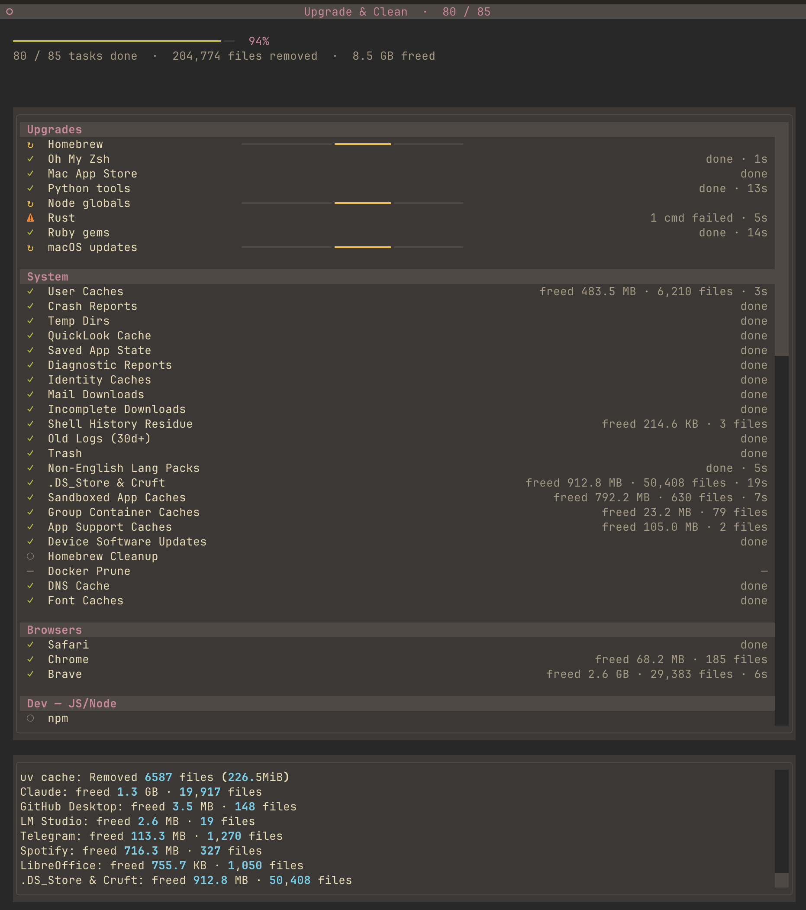

# tidymac

A macOS upgrade + cleanup TUI. It upgrades your package managers and sweeps
every cache it can find — dozens of tasks, all in **parallel**, with a live
progress bar per task and a running total of what it freed.



Every task is auto-detected: tidymac only shows Cargo if you have `cargo`,
only shows Brave if Brave is installed. Nothing is hardcoded to a machine.

---

## Setup

Requires **macOS** and **Python 3.11+**.

### With uv (recommended)

```sh
git clone https://github.com/rafapolo/tidymac.git
cd tidymac
uv tool install .
```

### With pipx

```sh
git clone https://github.com/rafapolo/tidymac.git
cd tidymac
pipx install .
```

Either one puts a `tidymac` command on your PATH.

### Without installing

```sh
git clone https://github.com/rafapolo/tidymac.git
cd tidymac
pip install textual
./tidymac.py
```

**First run: use `--dry-run`.** It sizes everything up and deletes nothing, so
you can see exactly what tidymac would touch on your machine before it does.

```sh
tidymac --dry-run
```

---

## Commands

```sh
tidymac                  # the TUI — upgrade everything, clean everything
tidymac --dry-run        # size it all up, delete nothing, run no commands
tidymac --headless       # one line per task, no TUI (for launchd/cron)
tidymac --snapshots      # also thin Time Machine local snapshots (needs sudo)
tidymac --no-report      # skip the JSON run report
tidymac --install-agent  # write a weekly launchd agent, then exit
tidymac --help
```

Flags combine: `tidymac --headless --dry-run` is a safe way to see what a
scheduled run would do.

In the TUI, press `q` to quit.

---

## What it does

**Upgrades** — Homebrew (update, upgrade, casks, autoremove, cleanup, doctor),
Oh My Zsh, Mac App Store (`mas`), Python tools (`pipx` / `uv` / `pipupgrade`),
npm globals, `rustup`, Ruby gems, and macOS software updates.

**System** — user caches, sandboxed app + group container caches, crash and
diagnostic reports, saved app state, Trash (including per-volume trashes),
QuickLook thumbnails, logs older than 30 days, non-English `.lproj` language
packs, `.DS_Store` files, build cruft (`__pycache__`, `.pytest_cache`,
`.ruff_cache`, `.mypy_cache`, `.ipynb_checkpoints`), temp dirs, DNS and font
caches, Docker prune.

**Browsers** — Safari, Chrome, Chrome Canary, Chromium, Brave, Edge, Vivaldi,
Opera, Arc, Dia, Firefox, Zen, LibreWolf, Tor, Orion. Chromium-family browsers
are cleaned across *every* profile.

**Dev** — JS/Node (npm, yarn, pnpm store prune, bun, Vite, Webpack, Turbo,
Cypress, Puppeteer, esbuild, Nx, nvm), JVM (Gradle, Maven), Python (pip,
Poetry, pyenv, conda, uv, pre-commit, Jupyter), Go, Rust (Cargo registry,
rustup downloads, sccache), Ruby/PHP (gem cache, Bundler, Composer), plus
NuGet, Swift PM, Deno, kubectl, AWS CLI, gh, Helm, Terraform, ccache, gcloud,
Ansible, Zig, yt-dlp, Ollama logs, PyTorch, Hugging Face.

**IDEs & Editors** — Xcode (DerivedData, Archives, DocCache, device logs and
device support), iOS Simulator, Android Studio + SDK, JetBrains, VS Code,
Cursor, Windsurf, Zed, Sublime Text, Neovim, CocoaPods, Flutter.

**Apps** — Slack, Discord, Signal, Notion, Obsidian, Postman, Insomnia, Claude,
GitHub Desktop, LM Studio, Telegram, Spotify, Zoom, Teams, Steam, Dropbox,
Adobe media cache, Docker Desktop, VLC, Transmission, WhatsApp, UTM,
LibreOffice.

---

## Run reports

Each run writes JSON to `~/.local/state/tidymac/`, with `last-run.json` always
pointing at the most recent one. The TUI log is capped and dies with the app —
this is what lets you compare one run against the last.

```sh
jq .totals ~/.local/state/tidymac/last-run.json
```

Old reports are pruned automatically.

---

## Weekly schedule

```sh
tidymac --install-agent
```

This writes `~/Library/LaunchAgents/local.tidymac.plist` for a Sunday 11:00
headless run, at low I/O priority. It deliberately does **not** load it — the
command to do that is printed for you:

```sh
launchctl bootstrap gui/$UID ~/Library/LaunchAgents/local.tidymac.plist
launchctl bootout   gui/$UID/local.tidymac    # to disable again
```

Agent output lands in `~/.local/state/tidymac/agent.{out,err}.log`.

---

## Notes on safety

tidymac deletes regenerable data only, and a few deliberate choices back that:

- **pnpm** uses `store prune`, never a store wipe — every `node_modules` on the
  machine hardlinks into that store, so deleting it outright would silently gut
  your installed projects.
- **uv** uses `cache prune` rather than `cache clean`, which would force every
  project to re-download its full dependency set.
- **Ruby gems**: only downloaded `.gem` archives and the remote spec cache are
  dropped — installed gems stay.
- **Temp dirs** skip anything modified in the last 24 hours, so files still in
  use by running processes aren't pulled out from under them.
- Tasks touching the same tree or package manager hold a lock, so a
  `brew upgrade` can't race a `brew cleanup`, and the blanket cache sweep can't
  race a per-app cache task.
- Child processes get `/dev/null` on stdin and their own session, so nothing
  can steal keystrokes from the TUI or hang forever on a prompt.

`--snapshots` is the one flag that needs `sudo`, and it's opt-in for that
reason. Time Machine local snapshots are not a substitute for your backups, but
deleting them does reduce what you can roll back to locally.

---

## Linux: `tidy`

`tidylinux.py` is the Linux sibling: same engine and TUI, with a Linux task
table — APT (`full-upgrade`, `autoremove`, `autoclean`), snaps (refresh plus
dropping disabled revisions), Flatpak, the systemd journal, `~/.cache`,
freedesktop Trash, and the native/snap/flatpak locations of browsers, editors
and Electron apps.

APT, snaps and the journal need root. Run from a terminal, `tidy` asks for the
sudo password once before the TUI starts; `--no-sudo` skips those tasks
instead. `--install-agent` writes a weekly systemd user timer.

It ships as one self-contained file (a zipapp with Textual vendored in), so
the target needs only `python3`:

```sh
uv pip install --target build/src --python-version 3.14 \
    --python-platform x86_64-manylinux_2_28 --only-binary :all: 'textual>=8.2'
cp tidylinux.py build/src/
python3 -m zipapp build/src -m tidylinux:main -p '/usr/bin/env python3' -c -o build/tidy
scp build/tidy host:.local/bin/tidy
```

---

## License

MIT
